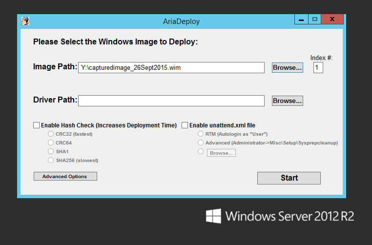
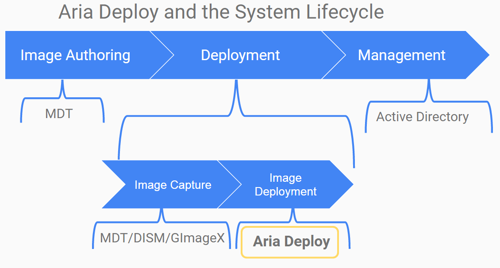
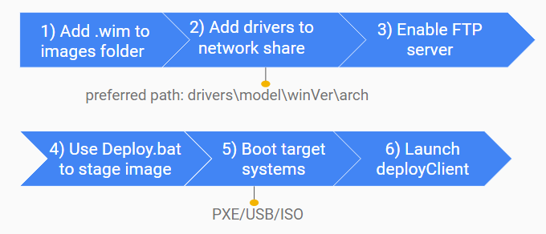

# AriaDeploy

AriaDeploy is a Tool for Deploying Windows Systems in Enterprise Environments

AriaDeploy transfers previously captured wim images (captured via dism/mdt/imagex/gimagex/sccm) over the network using Aria, a bittorrent client, and automates common deployment tasks, such as the installation of drivers onto heterogeneous hardware systems.

Currently AriaDeploy supports all Windows 7-10 x86/x64 and server images, both RTM and custom, for deployment on BIOS/UEFI systems.





## Key Features:

- Focuses on providing completely automatic deployment
- Aims to be a zero-configuration tool for automating simple deployments
- Supports complicated scenarios using customizable config.ini files and custom scripts
- Aims to be trivial to get started
- Supports automated configuration of drivers/disk partitioning/OOBE "out of the box"
- Seamlessly integrates into existing workflows
- Supports deployments in heterogeneous booting/pe/hardware environments transparently
- Eliminates dependency on fragile and configuration intensive multi-casting technology
- Excellent performance whether deploying to 5 or 500 computers
- Has minimal external dependencies
- Transparent design built using Free Open Source Software and industry standard tools (ADK)

## Planned Features include:

1. "Installation" script to build Windows PE wim/iso and transfer the relevant files -in progress
2. Support for deployment on heterogeneous hardware systems (via adding WMI packages to WinPE) -done
3. "Deployment-on-a-stick" scenarios -in progress
4. Automated deployment image and tools integration into recovery partitions (this is useful to OEMs)
5. AriaDeploy for OS/X (will be a while)

## AriaDeploy is/will

1. will deploy images in the standard windows imaging and electronic software delivery formats (wim/esd)
2. will reformat the main disk on the target systems as specified (normal or minimalistic)
3. will automate the installation of drivers
4. will make the target systems bootable using the PE boot mode information
5. will automate oobe
6. allow for asynchronous deployments, unlike traditional server-clients using the high-configuration mulitcasting model
7. is designed to integrate into existing MDT and SCCM workflows, including those involving Active Directory

## AriaDeploy is not/will not

1. will not capture images or deploy virtual disks (vhd/vmdk files)
2. will NOT preserve user data on target systems
3. will not download ADKs or the correct drivers for you
4. will not determine that windows version X cannot boot as configured on target system Y due to incompatibility Z
5. will not auto-generate unattend.xml files (use MDT for that instead) or input the correct product key for you in the provided unattend.xml templates
6. is a just tool, not a full system lifecycle deployment solution
7. is not dependent upon WDS/MDT/SCCM/Active Directory

## Typical Usage Guide:



1. (optional) Download drivers for your hardware model(s) from [Dell](//en.community.dell.com/techcenter/enterprise-client/w/wiki/2065.dell-command-deploy-driver-packs-for-enterprise-client-os-deployment), [Lenovo](//support.lenovo.com/us/en/documents/ht074984) and [HP](//www8.hp.com/us/en/ads/clientmanagement/drivers-pack.html) 
2. (optional) Extract to some folder like D:\Drivers\Dell\Optiplex9010\Win7\x64
3. Double click on AriaDeploy.exe
4. Select your wim image created using DISM/MDT
5. (optional) Select the drivers folder from step 2 (D:\Drivers\Dell\Optiplex9010\Win7\x64)
6. (optional) Select the type of unattend.xml file to use, an RTM one or a custom one
7. Click on "Start"
8. (optional) Start FTP server
9. Boot target systems using Windows PE (any version of PE 3.x+ using any boot method: usb drives/cds/PXE) 
10. Map network drive from within Windows PE (or use the included script to do this automatically using FTP)
11. Start Y:\client\AriaDeployClient.bat (or use the included setEnviornment.bat to do this automatically)

## Download:

Click [here](//github.com/gdiaz384/AriaDeploy/releases) or on "releases" at the top to download the latest release

For the latest non-release ready version, click on "Download ZIP" at the top

## Install guide:

For detailed documentation please see [Aria Deploy's official documentation](//docs.google.com/document/d/1Xte7ej58oPpJlLjvgUamBO-JwuC_FLBWcxcnc87WK2Q/edit?usp=sharing)

I have bundled most of the dependencies into the installer, but due to the ADK's non-redistributable clause, I cannot provide prebuilt WinPE images (part of the ADK) for use with AriaDeploy. For similar reasons, I also cannot provide full unattend.xml files, only templates for them.

1. Download and extract AriaDeploy to workspace\AriaDeploy
2. Download and install the [ADK for Windows 10](//msdn.microsoft.com/en-us/windows/hardware/dn913721.aspx) and/or [Windows 8.1Update](//www.microsoft.com/en-US/download/details.aspx?id=39982), and/or [Win7's AIK] (//www.microsoft.com/en-us/download/details.aspx?id=5753) and [supplement](//www.microsoft.com/en-us/download/details.aspx?id=5188) Having all 3 is prefered for maximum flexibility but just one of the above will also work.
3. (optional) While waiting for the ADKs to download/install (takes a while), go download drivers for WinPE from  [Dell](//en.community.dell.com/techcenter/enterprise-client/w/wiki/2065.dell-command-deploy-driver-packs-for-enterprise-client-os-deployment), [Lenovo](//support.lenovo.com/us/en/documents/ht074984) and [HP](//www8.hp.com/us/en/ads/clientmanagement/drivers-pack.html) 
4. (optional) extract the PE drivers to the appropriate folders: AriaDeploy\drivers\WinPE\5_x\x64 or 10_x86
5. (optional) Also get the [generic RTM unattend.xml files](//github.com/gdiaz384/AriaDeploy/tree/master/redist/AriaDeploy/resources) and here for the [MS license keys to use when deploying systems](//technet.microsoft.com/en-us/library/jj612867.aspx)
6. (optional) Input the MS keys into the unattend.RTM.xml files
7. Share the workspace folder of workspace\AriaDeploy via read-only CIFS (suggested share name=AriaDeploy$)
9. (optional) For automatic drive mapping, install an FTP server and share workspace\AriaDeploy\client\resources over ftp
9.5. (optional) update workspace\AriaDeploy\client\resources\credentialsForNetworkDrive.txt
10. After the ADK finishes installing, double click on AriaDeploy.exe

## Version History/Planning

Note: The current focus of development is on architectural improvements and features.

```
Current Version: 0.4.1b
In Development: 0.4.1rc-1

::2.0.0 added partial mac support (no drivers)(?) winpe/dism not licensed for use on non-windows systems, 
::gparted can HFS+, rEFInd can boot, live distros are common, just need to find one that can access NFS/CIFS shares easily
::might need to convert batch script to .sh so maybe AriaDeployForMac
1.1.0 added optional 7zip deployment scenario
1.0.0 formalized and streamlined "deployment on a stick" and installer scenarios
0.4.1 added heterogeneous hardware support using WMI, (requires WMI components in PE images however), made server side client agnostic
0.4.0 added support for "deployment on a stick" scenarios (by replacing qTorrent with py3bt_tracker), made server architecture agnostic, bug fixed AriaDeploy.exe
0.3.1 refractored code, improved overall reliability, created "installer", switched to FOSS qTorrent over uTorrent for server aspect, and reduced requirements
0.3 refractored code, addedUI, improved client side reliability, changed name to "AiraDeploy"
0.2 refractored code, added server component, improved scalability (architecture agnostic using Aria instead of uTorrent3.3)
0.1 "massDeploy" concept art using uTorrent 3.3/psutils, client side only
```

## License:
Pick your License: GPL (any)
